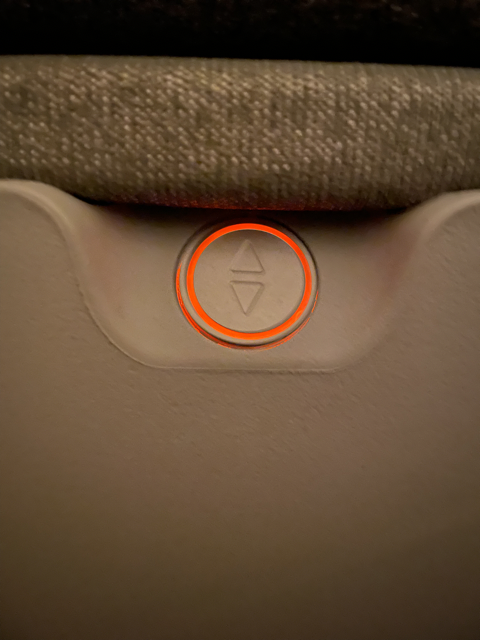
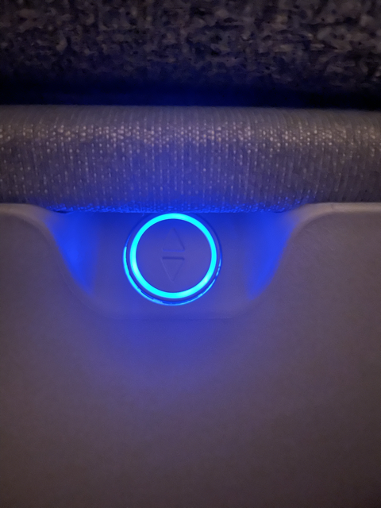
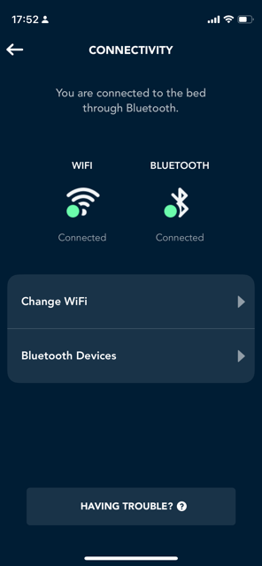
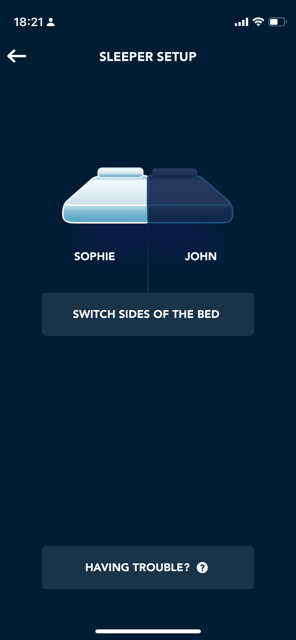
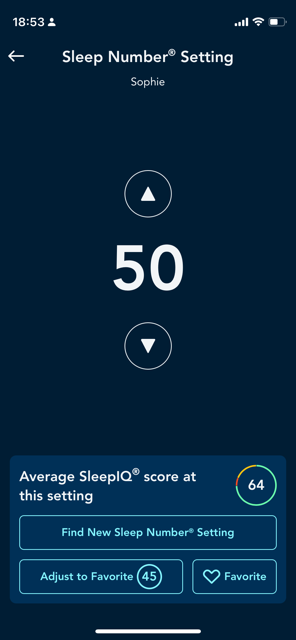
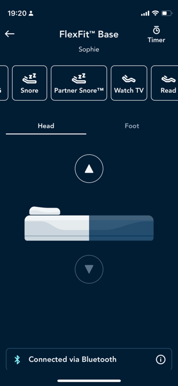
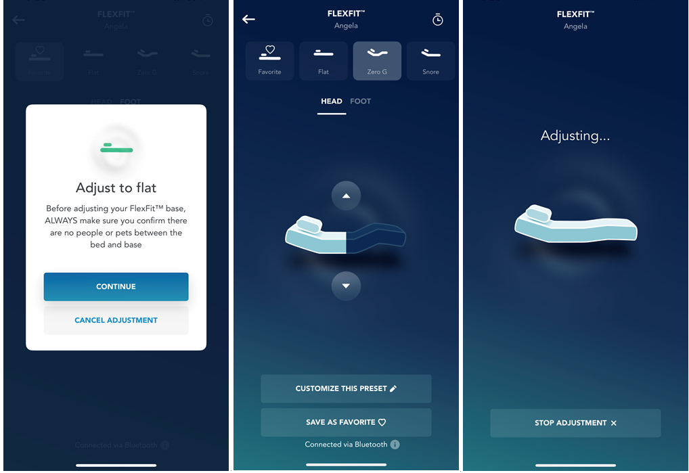

**Journal Entry 1: "My Sleep Number Saga"**

By: Sophie Hammar

Date: Oct. 10, 2023

---------------

**Introduction**:

Hi there, my name is Sophie! I am a 31-year-young full-time computer science major and I also work roughly 20 hours a week. I am always on the go! Needless to say, after a long day of work and school, I am beat and look forward to a well-deserved good night's rest. 

My problem? 

I have been sleeping on the same droopy spring mattress for almost a decade. I feel like this has led me to sadly deal with restless nights, groggy mornings, and worst of all, lower back pains! (At 31 years old, mind you). So, I decided to take the leap and invest in the highly acclaimed Sleep Number "Smart Bed". Backed with a promise of customizable comfort, I embarked on this sleep journey to explore the usability and user experience of my new and high-tech "smart bed".

---------------

**Goals**:

My primary goal was to assess how effective the bed is in providing a full night's sleep while targeting sleep patterns, comfort, and support, and to hopefully alleviate my history of back pain.

---------------

**Interaction**:

Once the bed was ordered, delivered, and set up, I was eager to jump in and start my slumber. But first I needed to link my smartphone to the smart bed through Bluetooth. (The sales associate at the store offered to sell me a remote for $50 extra to control the bed with, but also sleuthely, and not in front of his manager, he told my partner and me that it wasn't necessary so long as we had a smartphone or tablet. He said it would be a breeze connecting to the bed via Bluetooth and using our phones to control the bed...and he was right!) 

I followed the very **efficient** instructions to link my phone to the bed via Bluetooth. **Efficiency** is very important when considering using a new application. You want your experience with it to aid your lifestyle and make it easier, not disrupt it more. The "Welcome to Sleep Number" note that came with the bed, instructed me to download the Sleep Number app, "SleepIQ". Easy Peasy. Done. **Efficient** to say the least.

After setting up my profile, prompted by the app, I was instructed to find the salient glowing red button on the side of my bed, that I chose to sleep on. After locating that button, I pressed it as instructed, until the light changed from red to blue. Just like that, it was connected! Confirmed on my phone's general settings under the Bluetooth tab, in addition to confirmation, that I was successfully connected, within the SleepIQ app as well. There it was, clear that my smart bed was successfully connected to my Bluetooth and that I was ready to start my sleep number journey.

 

Also, as to not confuse what side of the bed I was choosing that correlated to the syncing through the app, an image of the bed appeared on my phone to confirm my side of the bed! I thought this feature was very **useful** to help with **error tolerance** in ensuring that I was choosing the correct side of the bed I wanted to sleep on and sync to. I could trust that the pillow indicated where my head would rest and the opposite end would be where my feet go. Mind mapping for the win! In a matter of minutes, my side of the bed was synced to and personalized with my profile.

Finally, I could lay down! Once I was horizontal in bed and on the app, I was instructed to choose my firmness level. I found the user interface to be straightforward and as expected. I appreciated the digital display that showed the current setting and the real-time feedback on how my adjustments were affecting the bed. This aligns with the concept of **learnability** as I could easily understand how to use the technology. It is critical when using anything new--a coffeemaker, a water bottle, an app--to ensure that you don't have a super steep learning curve. When implementing **learnability** in a new technology the user experience is upgraded; the user is not dissuaded when using the app or device for the first time. This ensures that the user will come back and use the 'technology' over and over again and not feel like it is over their head or much too advanced for them to go back to. 

I would rate the **learnability** of the sleepIQ app as good--however, every new app/technology is subject to criticism, and everyone has their own opinions. While I might have caught on quickly to the sleepIQ app, I felt that there could have been another indication on the sleep number scale to show more clearly that the higher the number the firmer the mattress, and vice versa. With that being said, the real-time adjustments and display of the "sleep number" were **effective** in understanding which way is softer and which is firm.

---------------

**Outcomes**:

Once I logged a few nights of sleep, I was able to see a comparative analysis of my sleep patterns. Some of these sleep patterns include, how long it takes to fall asleep, how long during the night I was restless, how many times I got out of bed in the night, and what time I woke up! These records of my sleep patterns felt very **reliable**. The **reliability** is a very important piece of trusting the product. If I didn't have trust in the **reliability** of the product, I would not think highly of the product/service/technology. Through the app, I could trust the statistics and reports I received as I could ensure the **reliability** was top-notch based on my knowledge of when I went to bed and when I woke up in the morning. 

I found that it was very **satisfying** to learn about my sleep habits. I loved learning about my habits more in-depth and with more ease. The **satisfaction** factor is important because it lends to the likeness of the product. If I am **satisfied** with something, I am more likely to talk about it positively, recommend it to friends and family, and be pleased with my experience overall.

Additionally, Sleep Number provides a sleep-smart technology that adjusts to your body, while sleeping to try and mitigate restless movement. While I have grown to love this feature as it has helped my lower back pain immensely, it was startling at first. I wish there was a more **effective** way that this feature could be communicated, to not alarm or disturb any user in their sleep. I think that this feature could be better conveyed in the future by the sleepIQ app. However, even with that being said, using the app, with its insightful sleep metrics and suggested improvements, enhances the bed's overall **effectiveness** in achieving my sleep goals. The sleep-smart technology contributes to the bed's **effectiveness** and prolonged **satisfaction** for me as a user since it can prevent further discomfort and pain.

---------------

**Strengths**:

As previously mentioned, the app's interface is very **learnable** and matches user expectations with easily recognizable icons and clear labels. Let's say I want to sit in bed and read my book at a comfortable angle, I click on the button that looks like a bed, labeled as "FlexFit", and click on the icon that shows a predetermined adjustment labeled "reading". It also helps that the interface displays the "shape" in which I am going to be positioned to help with visualization. From the chosen angle/position, I can select an icon assigned to "head" and/or "foot" to the desired adjustment, using up and down arrows. I could then save and label "favorite" positions that I might regularly gravitate towards. I rarely found myself fumbling through these menus, making it an **efficient** and user-friendly tool.

A feature that I also was not expecting but found very **useful** is its safety feature! Anytime you adjust, you have to confirm that there are no people or pets in the way of the flexible base before it makes adjustments! This **safety** feature was unexpected but so **useful**. **Safety** is a huge concern as it is a liability for the product/technology at hand, but also as a user concern. I am not going to use something that is not safe...especially when it comes to my loved ones **safety**. This is a top concern for users. 

I have a dog who often sleeps at the foot or sides of the bed. I didn't even think of him being unsafe around this new product/technology...but Sleep Number provided a very **useful** **safety** feature that I would not have otherwise thought of!

---------------

*Disclaimer: This journal entry represents my personal opinions and experience with the Sleep Number Bed and is not affiliated in any way with the Sleep Number Franchise*
